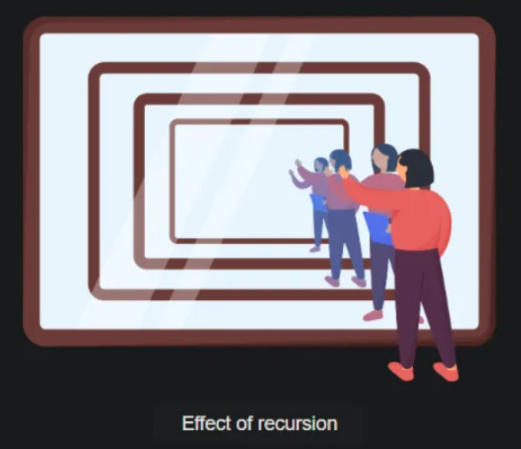
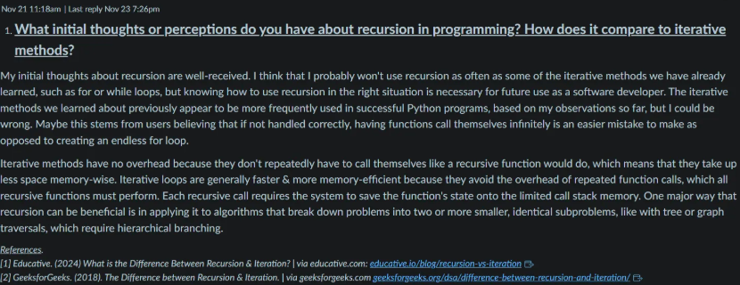

## Wednesday, 12/11/2025 ✒️
## https://bit.ly/48OAx5e

The Fall semester is coming to an end this week & I'm starting to feel less stressed already. I believe I did well in most of my classes, but I won't know my grades for another week or so. Next semester I'm taking three more: Algebra, Network Technologies & Security Essentials. I'm looking forward to starting them, but I just hope I get to take more in the future about Linux, Python & System Design because I enjoyed all of them this past semester. In addition to the other markdown-journal files I have in this directory, I decided to upload some of my discussion posts in their own markdown files too because they're essentially journal entries in themselves & I want to be able to reference some of the things I've learned later on before I no longer have access to them. I've also taken screenshots like the one I used above, which I added into my Notion account so I can see all the posts in their original format, along with having the text in markdown files.

However, now that I have these examples from this past semester, it will be easier to replicate in the future for any new discussion posts. In addition to my YouTube account that has new videos I've uploaded from a project about Linux that I completed this past semester, I'm going to upload some of the other important projects I've completed into my repository here soon, so I can formally add them to my portfolio instead of only having them locally on my device. Shout out to my Python tutor from this past semester! They're good people & advised me to do well but they also taught me one extremely valuable lesson that's going to save me a ton of space on my computer. I was using VS code during our tutoring sessions, when they showed me how to use Codespaces here on GitHub. So instead of jumping on my local terminal by default because it seems like the quickest option, I'm going to work here on the Linux terminal in Codespaces a lot more. I also love the preview mode inside the terminal so I don't have to go back & forth as much between here & the browser! I need to mess around with it a little more tomorrow though. Online GDB is another Linux virtual terminal I learned about this past semester & I really liked using it too to officiate code that I submitted to my professors, but I will still probably keep most of my code here in GitHub. 

-----
-----
-----

## Wednesday, 10/08/2025 📁
## https://www.teamgantt.com/
## https://www.youtube.com/watch?v=bbmWOjuFmgA

Finally finished Part 2 of my System Analysis & Design project before the submission deadline. It's tedious, but I'm enjoying going through a hypothetical scenario where I'm setting up industrial grade wi-fi for a plant nursery retail chain! I find it satisfying mostly because I'm thoroughly analyzing every single step I make & I'm accomplishing everything I set out to do. Please refer to the image above regarding the GANTT chart I made for my project. The full twelve page document also includes a feasability study, cost estimations & a prelimary investigative report - although this isn't the final product, just a draft for now.

Later on in the evening I switched gears to focus on my Linux Fundamentals course. This module, we're mostly learning about filesystem management by watching youtube videos (like I added above) & working inside a virtual terminal via Cengage. Below are some of the commands that I used today specifically. I'm finding that the `sudo` command to be incredibly important when it comes to navigating in the terminal. The `sudo` command (Substitute User DO) permits a user to execute a single command with the same security privliges of another user, which is referred to as the "root" user or `superuser`. This gives administrators a safe way to perform tasks without having to log in as the root user, which reduces the chance of inflicting digital damage.

We also learned about designing hard disk layout, creating partitions & I used the `fdisk`, `mount` & `unmount` commands for the first time. If I'm understanding things correctly, `fdisk` allows us to view, create, delete & manipulate disk partions (dividing a single physical hard drive into one or more seperate, independent regions) on a hard drive. Mounting is the process of attaching a separate storage drive to a specific empty branch on that tree, while unmounting is the process of detaching the storage device from its `mount` point.

`su root`
`p@ssw0rd`
`visudo`
`Student1   ALL=(ALL) 	ALL`
`esc` + `:wq`
`su Student1`

`sudo fdisk /dev/sda`
`m`
`l`
`q`
`clear`

`sudo mkdir /mnt/cdrom`
`sudo mount -r -t iso9660 /dev/cdrom /mnt/cdrom`
`ls -l /mnt/cdrom`

-----
-----
-----

## Wednesday, 10/01/2025 ⌨️
## https://www.youtube.com/watch?v=u-OmVr_fT4s&t=1s

Today I worked with my tutor from college once more on some python practice problems assigned to me that involves creating functions. The YouTube video link above is one way we learned about functions before working on something similar to the assignment for Module 6, which is what I worked on with my tutor. One thing they pointed out that ties into another class I'm currently taking, Linux Fundamentals; is how they no longer use VScode for hands-on coding. Instead, they use Codespaces here inside GitHub & the terminal used by GitHub is Linux.

I only have experience working inside of Windows Powershell, but after taking my Linux Fundamentals course this semester, I'm looking for other ways to practice using Linux commands in the terminal & this is the perfect way I can practice from here on out. Normally in class, I'm working from a virtual terminal anyways, so this works & functions exactly the same as I've been taught + the syntax really isn't that much different from what's used with Windows. I also started a Linux Journal to document my Linux journey specifically which is the second link above, just like I did with my Java projects from earlier this year. 

-----
-----
-----

## Thursday, 09/25/2025 🐍
## https://youtu.be/g1AFlLhgMR8?si=GDUwlqEKlTjj5xRo

I cannot express how fulfilling it's been for me to start working with a tutor again. Thankfully someone at my school has been working with me this semester because although a lot of the stuff I'm learning about in my Python class so far isn't necessarily new to me, I'm still a little shaky when it comes to hands on coding. My biggest issue continues to be having difficulty parsing the questions from english into code when I'm given a blank canvass but I know I have to overcome this through practice. For now & the foreseeable future, I can't imagine learning without meeting with a tutor on a regular basis.

Above is one of the video lessons from YouTube that we watched for my class this module & beneath that is a screenshot of some of the code I wrote out during it, it's about the differences between for loops & while loops. The biggest takeaway for me was clearly seeing how for loops are best used when you already know how many times you must iterate, while loops on the other hand are best used when conditions must be met beforehand. I worked on a different assignment with my tutor that elaborated further on using while loops with conditional statements. Until next Wednesday when I meet with my tutor next, I've got to refocus on my Linux & System Design classes which I plan on writing a little more about in here soon too. 

-----
-----
-----

## Monday, 09/22/2024 📝
## https://www.freecodecamp.org/news/start-a-career-in-technical-writing-through-open-source/ 

After a long day & evening of studying the basics of Linux once more for my college course, I found a lot of inspiration in reading more about technical writing via FreeCodeCamp. Through my background in marketing & writing newsletters, I've grown accustomed to writing out what I've done while I code. While I still might not be an expert technical writer myself, I know it's within my ability to bridge the gap between developers & users by explaining every step or process in a concise manner.

Next week I'll begin contributing to an open source project of my own choosing, so I can reengage in technical writing for others. This almost feels like being a Wikipedia editor & translating articles from language to another, but this is a little more complex & fulfilling to me. If you have any suggestions or experience in technical writing, please reach out so we can connect! As a side note, the new FreeCodeCamp app is amazing too; the daily coding challenges they provide are helping build my confidence in myself, particularly with Python.

-----
-----
-----

## Tuesday, 08/12/2025 🎬
## https://bit.ly/46SHD9w

Spent the morning & afternoon finishing getting all of my projects organized for making these demo videos. It took a little longer than anticipated because I wanted to make sure that I had mostly everything in the videos on here as well, which took an hour or so working locally inside my terminal with Git to get everything compatible with what's on GitHub. This also included writing & editing some more technical documentation. But now that five out of the six videos are done, I only need to finish one more, but I won't do this until I finish working with my friend on getting that last project deployed live with it's own host because the previous system stopped functioning randomly earlier in 2024. I don't have an exact timeline on when that will be done precisely, but it should be finished before the month of October starts. Until then, I need to make four different proto-type landing pages for clients & prepare for this upcoming semester. But I won't be starting those things until next week so I haven't decided on any of the technical specifications yet either.

-----
-----
-----

## Monday, 08/11/2025 🎨
## https://bit.ly/46SHD9w

My hiatus from journaling on here took a lot longer then expected. Between now & then I've read some books, finished some college courses & most importantly finally brought my portfolio to live here on GitHub. Take a look using the link above but the image below is in regards to adding an artist palette emoji (YouTube Link) to its footer by creating a new div wrapping around the old div (Flashlight Emoji) & new div with a class of footer-content, then added some new CSS properties like 'inline-block display' instead of just 'block display' to ensure they'd sit next to each other, as opposed to above or below. As for the rest of this week, I'm going to finish making some more video demos for all the different 'generations' I've projects I've made, then start preparing for the upcoming semester where I'll be taking a new Python course & another on Info Tech Project Management - wish me luck!

-----
-----
-----

## Tuesday, 01/07/2025  💡
## https://youtu.be/9cr1XZlEir0

Though I definitely needed a break these past few weeks, I'm happy to be back learning something new again. Java's syntax never really grew on me in regards to learnability, but I do appreciate having a solid understanding of at least one onject-oriented programming language. I'll be using it again soon but for now I'm going back to my Practices of the Python Pro book to continue reading again in my spare time, along with starting a Linux introduction course on CodeCademy to parallel the new college course that I just started taking today called Linux Fundamentals. In a few weeks I'll be starting another IT course as well, called Network Technologies. One major thing missing from this journl are screenshots, which I'll be including from here on out to showcase my progress in a more literal way. As for today, I'm mostly just reading, but ended it watching an interesting YouTube video suggested by my new professor.

-----
-----
-----

## Tuesday, 09/24/2024  ☕️
## https://bit.ly/4iNmKQI

I decided to start a new code journal spefically geared towards the Java projects I'm working on this semester; same idea as here, but inside it's own md file. I did this because I really want to submerge myself into the world of Java to absord as much info as possible & focus on nothing but that right now because I'm having a really hard time ascertaining a lot of this information.

-----
-----
-----

## Friday, 09/13/2024  ⏳️
## http://www.flowgorithm.org/index.html

Too much time has gone by without writing in here! I just started a new semester & one of the courses I chose that's required by my degree was Programming in Java; there is also an advanced course & possibly a third. Mainly because as I've learned over the years, it's one of the most frequently used object-oriented programming languages because it can do a lot on it's own as opposed to procedural languages like JavaScript, HTML & CSS. I credit Codecademy once more for instilling some of tthe basic into me on the regular like creating projects. With the procedural languages, you write commands & variables, whereas java is a little more sctructured & essentially has it's own framework built into it. Each file must contain a class that matches the file name, "public class HelloWorld {}". Then you must input the arguments of the project inside the class like the following, "public static voic main(String[] args {}". My first project was simple but I'm proud that I'm off to a good start.

-----
-----
-----

## Tuesday, 07/24/2024 ➡️
## http://www.flowgorithm.org/index.html

I'm almost finished with my second semester of college which makes me really proud. I chose my computer courses for next semester already too: Programming in Java, Intro to Database & Network Technologies. I just started learning about some fundamental Java concepts in Codecademy in my spare time during the morning so I've got a few facts remembered but I'm even less experienced with handling databases & networks so it'll be fun to learn a lot of new things. As far as the one computer course I'm still taking right now, I've been using a new program called Flowgorithm for a few assignments which has helped me visualize coding problems a lot; like what logic is necessary to build a tip basic calculator. My final project is about building a chat bot to respond to some questions or jokes & I think I know how I can customize it after class is over to do something a lot more useful too. There's a lot more to learn but I'm ready, onward.

-----
-----
-----

## Tuesday, 06/11/2024 ⚽
## https://play.google.com/store/apps/details?id=python.learnpython.learn.pythonx.coding.programming.python3.tutorials.codingx

Getting overwhelmed by the amount of school work I have + my roommate moving in has kept me from fixing that error with my soccer project. I'm going to have to re-deploy it again when I find the time in the coming weeks. I finished that mini-course on the app SoloLearn I was yapping about the other week. As soon as it started to get interesting in regards to creatint logical code by using for loops, it ended. So I'm using another one via the link above to hone in on Python because that's all I'm using in college right now. Right now we're learning some more about boolean values & floating-point numbers, still pretty easy stuff so far overall thankfully.

-----
-----
-----

## Friday, 05/24/2024 🔍
## https://www.zybooks.com/

Chugging along just fine with this new Intro to Programming class. We've only worked with Python so far & now it's looking like it'll be just that for the rest of the semester at this point which I'm pleased with because I learn the fastest through it's easy-to-decipher syntax. We've mainly been focusing on making simple print statements & defining variables to get a better grasp of the syntax through a program called zyBooks, but since I'm familiar with a lot of this already it's been pretty easy so far overall to say the least. I'm enjoying starting from scratch though because I'm able to excel instead of constantly feel like I don't know what I'm doing. Not much else to report on now though, later skater.

-----
-----
-----

## Thursday, 05/16/2024 ❌
## https://www.anaconda.com/

Went to check on that old soccer project of mine & sadly encountered a major error; the API is not fetching data like it's supposed to even though I haven't made any updates to the project in a few weeks. In light of this, I also fixed a CSS issue that I thought had been resolved already but I was wrong as well. I had to create a new id for the Login page wrapper so the contents would span the entire width of the nav, this was done by setting max-width to 100 percent, previously the rules were overriding each other because they were using the same class name but for two different pages. Now I'm trying to debug what went wrong with the API: it could possibly be undergoing maintenence from its administrator but that doesn't seem likely (I could send them a message, but I don't see any announcement from them), it's most likely because the site is no longer deployed even though I don't exactly know how that could have happened. All the pipelines are passing in GitLab so as long as I deploy it again properly I believe it should work fine, however I need to find the correct method of doing so once more because I didn't expect to have to do this over. It's possible a dependency or two been updated again too, so I'm going to do some more research.

In the meantime I just started my next computer course in college - Intro to Programming. So far it seems a lot more advanced than the last course which makes me really happy. My professor instructed me to download a program called Anaconda for learning how to code better in Python. Next we launched a program called Jupyter Notebooks. I remember downloading the Jupyter application inside of VScode awhile back when I first started using it so I'm a little familiar but not entirely because I didn't use it a lot. After discovering it's utility through a walkthrough video, it seems like it could be a really useful tool, especially in regards to testing & note taking. In short it feels like if the programs Thony & Excel were combined with each other given how you can write in Python or Markdown. I was reminded how using the W + R command, followed by cmd & then hitting enter to navigate into the proper directory.

-----
-----
-----

## Wednesday, 05/08/2024 🌱
## https://bit.ly/4oTCkMi

I set a new record for consecutive days of practice on Codecademy (136) while finishing 2/3 of the SoloLearn module on web development that I've been working on. While I've been away from my computer, they've truly helped me learn more in bite-size pieced pieces along with creating a healthy habit. I just finished the CSS portion on SL & now I'm moving onto JavaScript which I'm really happy about because it's been relatively easy so far even with the few new things I've picked up; like how to properly use transition & transform in CSS. After I complete that, I might starting using another app to completely focus on Python for a little while. I found one called Python X & I like the UX a little more so I'm going to have to play around with it some more. In other news, the D.E.A. has announced a historic shift in policy whereas marijuana is set to be rescheduled from Schedule l to Schedule lll before the end of the year. This would finally legalize it's medicinal use at the federal level, which means it can also be researched nationwide & that veterans will now be able have it prescribe to them instead of being forced to use highly addictive opioids, amongst many other benefits. I'm feeling even more grateful that I participated in the Nucleate Cultivate Hackathon this year because my research pertained to using hemp as a main ingredient for a new type of cultivated, plant-based cheese. As soon as next year, I now might actually have the opportunity to conduct research regarding it's use in food at college now that it might actually be accessible.

-----
-----
-----

## Monday, 04/29/2024 🧀
## https://climax.bio/ 

Shortly after I finished my project for Nucleate Cultivate, I discovered a new type of plant-based cheese that uses hemp seeds as an ingredient that's made by a company in California called Climax. Of course, the discovery was without controversy as they were preparing to be awarded the "Good Food Award" from the Good Food Foundation but was stripped of the prize for unknown reasons shortly before they were set to recieve it. It's possible I didn't do enough research given the bandwidth I had with Team Penguin but nonetheless I'm happy to find out that at least someone else is remotely interested - & successful - at doing what I dreamt of. I'll have to keep a close eye on them & others while I experiment with my homemade recipe this Summer & await the next Nucleate Cultivate Hackathon.

Now that my first semester of college is completed, I'm moving onto the summer semester. I finished with an A in both classes, which I'm extremely proud of. So I'll be taking a break from most of my work & studying these next two weeks to regroup. During that time, I'll be recording an acoustic demo with my old band. We agreed to try & wrap things up right this time so we can either have this for keeps or use it to record a more well-polished EP. We have three songs we'll be working on along with an intro & an outro. After it's completed, I'm going to start working on some solo stuff that I've been wanting to finish for even longer than this little demo. We will still need to take some time editing the demo, but after the recording is done then I'm going to actually start writing some code for the new record label I wrote about it in my last entry below which I'm incredibly stoked about.

I wanted to look up the latest Major League Soccer standings on my phone today to celebrate how Miami is Number One in the Eastern Conference right now + they're beating all the Western Conference teams by points too. But when I visited the Login page, I immediately notice how the form wasn't centered beneath the Nav. Instead it was sticking out on the right, but I think I know how to quickly fix this problem in the Login.css file. I compared it with the CreateAccount.css file & input any changes I thought would help but nothing did. So I figured I need to make a new styling decleration inside the .center-container & .wrapper classes. I tried using the calc function within the width property but that didn't do anything either. Then I remembered the box-sizing property. I created a new property inside of the .wrapper class & set the border-box to content-box. But still, nothing changed. I then used border-box instead of content-box & eureka, problem solved.

-----
-----
-----

## Wednesday, 04/17/2024 🐧
## https://bit.ly/3XT7mc2

Been incredibly busy this past month moving & finishing my first semester of college. My Microcomputer Applications course turned out to be a lot easier than expected which is somewhat of a relief although I'm ready for something more challenging with my next one, Intro to Programming. In the meantime I keep breaking my daiy streak records with my early morning coding puzzles & nearly finished a project for Nucleate Cultivate regarding cellular agriculture. The outcome wasn't as thorough as I had wanted it to be initially, but I'm grateful for this experience because it gave me a great foundation of how & where to move forward from here. I didn't have enough bandwidth to make a new application per se, but I have a lot of questions answered & now the only thing left to do is make a short video demo of the project via Loom. I'll be presenting my work ten days from now to staff / peers; I'm ready to learn more from their feedback. Hopefully I'll be accepted to attend next year again because this was an eye-opening & all-around amazing experience.

Considering how much I learned from this last project with Nucleate, I now realize that there's a lot more work involved than I had previously realized - which is a good thing - but I have to finish getting my degree first before I can fully tackle those issues. In light of that, I'm going to re-visit something I've wanted to build for a really long time but conflicting schedules always got in the way. Drum roll please... a web app for an upcoming, small-size record label! It's still all in planning mode as of now, but I'm able to be as creative as I want with this one which to me is a lot more rewarding than having to stick to a very particular style of something. In the coming weeks I'll make a new repo for it specifically but until then I'm going to keep playing the new acoustic-electric guitar I just bought online. I've played enough guitars at this point to discern the difference between the good & the bad... this one is pretty damn bad... but it was cheap as hell & it's good enough to practice with at home especially because it came with it's own little amp.

-----
-----
-----

## Monday, 03/25/2024 🖼️
## https://bit.ly/44ri9Oq

By keeping up with these micro-lessons in the morning, I hit my first 7 day user streak in awhile using SoloLearn, my CodeCademy streak is now over three months long & I've surpassed 400 consecutive days on Duolingo. I'm proud of myself for keeping up this effort - it's truly changed my daily mindset especially because it's one of the first things I do every single morning besides pet my cat. Now I need to get back to my daily habit of playing Chess... I registered for a different computer course in college after speaking with my advisor. It's called Intro to Programing which I'm excited for because Microcomputer Applications has been a little mundane although we've started learning about more complex subjects as I moved further into the course like quantum computing.

After checking in on the app after MLS Matchday 6, I noticed that the words "Login" & "Password" started to appear out of their respective order in the Login form page. There are the two bars where you input info with the words Login & Password there by default to signify what should be input by the user, but then the words also appeared underneath each input bar. Very strange. I remember talking to my friend the other week who just started using React & was reminded of how breaking things could be easily resolved given the nature of the program which enables realtime UI updates. I went into the Login.jsx file & noticed there were Label elements made for the words "Login" & "Password", just like I had been working on this past week with this app called SoloLearn in my spare time. I removed them from the code & immediately noticed how they were also gone in my browser. I added them back in, just to make sure I was seeing things right & that's that thankfully! It's cool to see how random practice can help you easily identify different aspects in the applications we create.

-----
-----
-----

## Tuesday, 03/19/2024 🖥️
## https://bit.ly/455zYmf

School is closed today but that doesn't mean I'm off! Moving into a new place to live along with finishing my first semester of college has been a little more time consuming than expected so next week I'll finally be ready to get back to some hands-on coding. In the meantime, I can finally register for classes for the next semester. I want to meet with my advisor one more time, but I think the one titled Microcomputer Operating Systems is the right fit for me given I pass the Microcomputer Applications course I'm currently taking. My final is in late April & I'm very confident that I'll pass. 

-----
-----
-----

## Monday, 03/11/2024 📱
## https://www.sololearn.com

Back in the Winter I had started regularly using another app on my phone called Sololearn to practice more hands on coding in my spare time but as my cell phone deteriorated & I got caught up in some other projects I stopped using it. But now that I have a new phone I downloaded it again & reembarked on my 'solojourney'. I generally start from the bottom in any sort of learning course but after a few years of practice, I can confidentally say that I know a lot of this stuff already. In general, I am still very much a junior engineer but in regards to this first crash course from them about general web development, I'm set. Today's lesson was just about identifying different HTML elements like H1, H2 & P. It feels good reinforcing these foundational concepts though! Now I'm going to go browse through their course catalog one more time though so I can challenge myself a little more than this.

-----
-----
-----

## Monday, 03/04/2024 ☀️
## https://codecademy.com

I'm in the midst of moving so I'm not doing a ton of hands on coding these next two weeks but I still managed to reach a new milestone this morning! I hit a 365 day streak using Duolingo + I've used Codecademy for 365 days altogether too. Every day when I wake up I do three things: pet my cat, open my Duolingo app, then Codecademy. It's obvious why my cat comes first, but the other too come next before everything else I need to start my day because it truly helps to wake me up & start learning at the smallest level possible which makes getting the bigger tasks done seem a lot easier. I highly recommend using them to anybody with a busy schedule or wanting to learn more in their spare time.

-----
-----
-----

## Tuesday, 02/27/2024 🏅
## https://bit.ly/3KX1lIm

Pleased to report that the ol' soccer project is properly pulling data from the API for the new season! There will always be some stretch goals worth accomplishing to make the app a little cleaner, but everything is working & I'm happy with that for now. Considering everything worked for this new season, next season when San Diego FC makes their Major League Soccer debut they should automatically appear underneath the Western Conference section so long as the API administrator (UnlimitedAPI) integrates them in time. I will check in on this in about six months from now to ensure the database doesn't pause on us again for inactivity & then re-check in 2025 for SDFC. Other than that, enjoy everybody!!

-----
-----
-----

## Friday, 02/23/2024 ⏰
## https://confluence.atlassian.com/jira

I had an epiphany that resolves a mental road block I had in my mind about a big project I've been progressively building in my spare time. I couldn't figure out what the blueprint should be for a building design but after looking at the woods in my backyard this afternoon with my cat I finally understand. I know it sounds a little bit weird at first but it's all about bioengineering hemp for food, it's tough to explain because I'm still trying to understand what's happening myself if I'm being completely honest, so I'll just leave it at that for now. I know a lot of these journal entries don't sound like hands on coding experiences each time per se, but getting these ideas that are all about the code I want to write on 'paper' first inside these markdown files really does help me put everything into perspective. So next week is going to be great now that I have a lot of this old stuff figured out already. I submitted & completed my first ticket with Jira regarding this project too which felt great. I love note taking so I think I'm going to love using this to help in that aspect too. I finished almost all of my homework due for school early, now I have time to refocus on those TypeScript & Redux courses on Codecademy this weekend. I checked my WakaTime account for the first time in a while after I updated this journal; I should really pay for the upgraded version because they have the best data about me as a programmer since it picks up everything I'm writing in VS Code; below is a chart from them. Three cheers for getting everything done!

   

-----
-----
-----

## Thursday, 02/22/2024 🥅
## https://www.google.com/recaptcha/admin/

Inter Miami won their game last night 2-0 against Real Salt Lake, it was a good game. I couldn't help but check to see if the MLS project had indeed started working already & it was as of this morning! I'm glad to see that, so I'll assume the rest of the teams will follow suit once they play but it looks like we're off to a good start this season. I called into Pair Networks last night to check back in on one project I was hosting because they stressed the importance of adding recaptcha to a form I made. After properly diagnosing what was happening to them, they realized that somehow, I accidentally began the process of setting up an enterprise recaptcha account instead of just a normal one for individuals. They sent me the correct link & I began the process again of fixing this form once & for all + adding in another new e-mail address instead of using Gmail to communicate with. I'm feeling really good going into the weekend knowing that my portfolio is robust & functioning properly. Time to revisit my CodeCademy course on TypeScript & Redux!

-----
-----
-----

## Wednesday, 02/21/2024 🌎
## https://www.atlassian.com/software/jira

I've been meaning to open a Jira account for awhile now to start working regularly with ticketing systems for my business. Knowing the full benefits of note taking, I know that using this system will help put that knowledge to good use. Technical documentation has grown on me, as it provides insight into not only fixing bugs & troubleshooting in the past & present, but it becomes an index for the future on how to fix unique problems. I like the interface so far, my first ticket is going to be about something new I'm building... Also, the Major League Soccer season starts tonight which means I'll know soon if my 3rd party API is still working inside the MLS Monitor project. I'll call it quits once all teams have played at least one game though just to make sure everything is all good. But even after that I see one more potential fix that might need to take place in the future; the addition of San Diego FC to the Western Conference. The 2025 season calendar is yet to be announced, but I'll need to check in on this again then to make sure it still works. 

-----
-----
-----

## Tuesday, 02/20/2024 ⌨️
## https://www.codecademy.com/learn/learn-typescript

After finishing my classes at college today I realized that I needed to learn more about another programming language, but which one? I landed on TypeScript. TypeScript is a programming language that I first learned to use back at the software engineering bootcamp I went to. Now it's time to get some more hands-on coding practice with it. I enrolled in a new course via CodeCademy so at least in my spare time I have an easy way to learn more. They start off explaining how JavaScript may not be so useful when building large-scale applications which is why Microsoft released TypeScript to the public in 2012. It expands on the same principles behind JavaScript but now, "it allows us to write JavaScript with a set of tools called a type system that can spot potential bugs in, clarify the structure of, & help refactor our code". The first activity is the classic, Hello World! I run the tsc command in the terminal which created an identical index.js file, then input ls the confirm if that was true or false & it was there. So I ran the resultant of the JavaScript file with the node command node index.js & eureka! Hello World! was output into the console as expected. I'm off to a great start. Now I'm learning about type references. 

-----
-----
-----

## Monday, 02/19/2024 📨
## https://www.pair.com/support/kb/using-recaptcha/

Checked on all the e-mails in my scheduled folder inside of Weebly. I've been using them as a host for websites for years now because they also offer an effective e-mail marketing tool called Promote. You can't edit the code base much, but you can edit & publish e-mails in a way similar to programs like Mailchimp. This newsletter I'm currently working on is set to go out tomorrow so I figured it couldn't hurt to look them over one last time to spot any errors; in a little over a year from now I'll have finished this particular digital campaign I strategized. It's been nothing short of a success so far: 99 percent delivery rate, 41 percent open rate, 13 percent click rate + all subscribers get a free packet of organic seeds annually. It's mostly a data driven newsletter, where we publish different studies on a variety of subjects like working remotely & bioengineered plants. After, I started where I left off on getting this form to work correctly in a different project that's hosted via Pair Networks, but so far only a few e-mails have managed to arrive in the proper e-mail account's inbox. Maybe this is not the way I should go about this, because the From e-mail is listed as no-reply at your-domain dot com but I never actually registered that name so I think I should register a new e-mail address with Pair. After I'll have to get past a few more steps like creating a new account with Google reCAPTCHA. This is all according to the documentation provided by the host which I linked above. 

-----
-----
-----

## Saturday, 02/17/2024 🐸
## https://flexboxfroggy.com/

My cousin who is a software engineer showed me this random website called Flex Box Froggy awhile back so I figued I'd check it out again today because I haven't been working too much with CSS lately. It's easy at first but after awhile it gets a little more complex as you go through each level 1 - 24. For the first half of the levels, you're mostly working on using the selectors align-items, justify-content & flex-direction to match frogs onto lilypads that appear to the right of the code editor. One of the levels is described like this, "Sometimes reversing the row or column order of a container is not enough. In these cases, we can apply the order property to individual items. By default, items have a value of 0, but we can use this property to also set it to a positive or negative integer value (-2, -1, 0, 1, 2). Use the order property to reorder the frogs according to their lilypads.". It's a good way to brush up on some commonly used styling components + I love how it's animal-friendly. I got to level 24 which I'll finish in the morning & I forked the GitHub repo too to study it a little more in depth.

-----
-----
-----

## Friday, 02/16/2024 🔍
## https://bigfuture.collegeboard.org/

Spent the afternoon searching for other colleges to attend because my computer programming track doesn't allow for minors at my college. I didn't realize this until the approaching semester's deadline for registration so I signed up anyways to start, but now it's time to look elsewhere because I need to minor in Spanish. I keep expanding my knowledge everyday by reading physical books in Spanish everyday, practicing with Duolingo, listening to Latin music, watching fútbol at night & talking with my partner everyday over the phone but I need a tutor & a college level course to assist me in growing more. I have a lot of random questions that I need to ask a teacher so yep, onward I go in this search. I know there's something out there that's right for me, I just have to look in the right places. Outside of my personal life, as I've learned more about web development these past three years, I now fully understand the utility of being able to communicate in other languages. This sort of diversity makes life beautiful & allows us to solve unique problems.

-----
-----
-----

## Wednesday, 02/14/2024 🚪
## https://glassdoor.com

Took a break from doing hands-on coding today to re-evaluate all the projects I'll be working on & choose the one of most importance. I'm also continuing the job search so I can make a decent living solving problems. I looked inside Glassdoor dot com for the first time in awhile today, I see a couple of opportunities...

-----
-----
-----

## Tuesday, 02/13/2024 ❄️
## https://bit.ly/4q9BDiZ

Snowing like crazy today, at least half a foot, so my Valentine's Day plans are sadly cancelled... but at least I have my cat. I bought them a new bed - it's shaped like an old TV except it's hollowed out so they can sleep inside it - I hope they like it haha. My partner was incredibly understanding about the weather too, I love them so much & can't wait to see them soon 💘 After class today I delved back into another old project in a private repository that needed a quick fix. It's built mainly using PHP so I added in the new e-mail address to the form in my submit.php file thinking it would work fine but I never recieved any e-mails after several attempts. I couldn't spot any errors in the console & every form was successfully filled out in the browser due to the error handling I setup previously. Turns out I needed to ensure there were From and Reply-To values set for sending the e-mail itself. It goes something like this: $headers .= "From: noreply@your-domain-here.com" . "\r\n"; $headers .= "Reply-To: $email" . "\r\n";. I'm feeling really proud that I got a lot of these old projects touched up so I can move on from them & completely focus on learning/building new stuff like that chess application I wrote about yesterday + I have my school work, volunteer program with Nucleate Cultivate & a new project I'm working on regarding automating the agricultural process using non-virgin materials. I also went down inside this journal to sort through some of the old entries where the formatting was out of place & fix it. I was quickly reminded of when to properly use tags like < & > inside markup files. In some old entries, I used them to describe some of the code I was working with, but .md files listen for those sort of inputs too because the file is 'alive', so they must be seperated like I previously mentioned or you can use quotes to indicate which elements you're creating. Fun stuff!

-----
-----
-----

## Monday, 02/12/2024 ♟️
## https://github.com/boosungkim/custom-chess-engine

Talked with my colleague again about resolving that AttributeError but after going through all of the site processes once more & ensuring that everything still worked, we both concluded that this one will have to remain a mystery for now at least. If you have any more information on this sort of error, AttributeError: module 'bcrypt' has no attribute '__about__', please reach out to me here to discuss! In regards to the original TypeError, it was really frustrating at times but patience is a virtue + now I'm in gear for the upcoming MLS season which starts in two weeks which I would have had to look out for anyways to ensure the API is updating with the new season - as long as it's successful I'll call this project finished. Thanks to some guidance from friends I was reminded of the importance of checking the deployed logs over just the server logs & of how to update variables in GitLab that repesent a MongoDB URI. In my spare time, I want to create a chess board application using Python so after researching ideas quickly, I came across the one I posted above which seems pretty reasonable but I need to do some more looking to make sure it's familiar all while challenging. 

-----
-----
-----

## Sunday, 02/11/2024 🍄‍🟫
## https://www.cultivate-tmrw.com/about

After cleaning my maple sap tapping equipment once more, I set them up so they should be good to go on their own for at least two weeks. While I wait for them collect sap that I'll eventually boil down into to maple syrup, I revisited Module One & Two of my hackathon project for Nucleate Cultivate which is a student group working to solve problems regarding the future of cellular agriculture, precision fermentation & alternative proteins. My group's still in the beginning stages of planning but it's looking good so far; I'm excited to share what we're working on as things progress in the coming weeks.

-----
-----
-----

## Saturday, 02/10/2024 ☮️
## https://learn.microsoft.com/en-us/credentials/certifications/azure-fundamentals/

Spent the morning looking over some Microsoft certifications a friend recommended to me, I linked one of them above. They seem interesting & worth obtaining but I need to finish configuring my schedule for the upcoming season before I commit to working on any more tasks. Later this aftenoon I recorded a video via Loom to help my colleague better understand the AttributeError I can't seem to fix. Now I'm going to finish my computer programming homework & rest before the upcoming week. Oh yeah, I created a new repository for my group with Nucleate Cultivate; I'll update it after we meet again.

-----
-----
-----

## Friday, 02/09/2024 🍁
## https://bit.ly/4acKb3M

I need to regroup to resolve this AttributeError from the other day. I know I can do it, but for some reason I can't recall the proper sequence of commands for updating my requirements.txt file now because when I rebuild my project in Docker, over 20 dependencies are added to my file. It's possible they're necessary now but I'm certain that one of them like 'passlib', 'bcrypt' or both are the root cause for the problem, per the fastapi logs. After, I met up with my group from Nucleate Cultivate & we discussed some different ways we can work together on this cellular agriculture hackathon we were accepted to participate in, like which plant(s) can be bioengineered to create protein. Lastly I prepared to tap my maple trees by cleaning the equipment & tomorrow I'm going to clean the yard a little more to make the environment the best it could possibly for the plants. On Sunday I'll do the tapping. I'm so excited to do this again & have some sweet maple syrup afterwards!

-----
-----
-----

## Thursday, 02/08/2024 ☕
## https://docs.oracle.com/en/java/

I met up with a senior engineer & my cousin last night for dinner to learn more about the software engineering company the SWE works for. Overall, their aim is help visualize data for clients by creating graphs using mostly Java & Springboot. I gained a ton of knowledge & discovered some new resources that I'm starting to look into just now. After meeting yet another engineer that uses Java, I'm convinced it's a language I need to invest more of my time learning about. This morning I finished my second week of college & it's still going well although we haven't delved too far into the syllabus for either class I'm taking yet. I'm going to dive back into that AttributeError for the rest of today, finish my homework from school & then prepare to meet up with my partners on my project from Nucleate Cultivate tomorrow. I'm also going to publish a longer journal update regarding that TypeError my colleague helped me resolve yesterday, but I need a little more time to prepare something more concise because I know I'm going to incur something similar again in the future.

-----
-----
-----

## Wednesday, 02/07/2024 ⚽
## https://bit.ly/3MuMhSQ

I had a massive breakthrough today due to a friend's guidance about an old project of mine. They recalled a new dependency update with MongoDB that I was unaware of, reminded me how I needed to add a new variable via GitLab so that this new URI was read right. I updated my .yml file to match the new variable name & finally added/committed/pushed to GitLab. When I went to my logs using glv-cloud-cli logs -a fastapi I recieved a new error; an AttributeError instead of a long conviluted one like I was getting with the TypeError. I'm investigating that some more now, but while I ponder I tested to see if I could login into the deployed project using our bogus passwword & eureka!!!!! I'm so happy this was diagnosed properly & I can move forward. I'll have to keep an eye on any updates from MongoDB & FastAPI, but now I know how to handle updates like that in general which will definitely come in handy in the future. Incredibly grateful for my friends & their willingness to work with me - working together really does work.

-----
-----
-----

## Tuesday, 02/06/2024 🐈‍⬛
## https://github.com/careercup/CtCI-6th-Edition

As I've written about previously, my friend who's been working as a software engineer for many years lent me a second programming book 'cuz they're a stellar person. Since learning about how other books' have repos here on GitHub, I looked up one about my new book & thankfully they have one too except it was more robust then most. This repo included many different versions for specific programming languages, so I forked one on Python for when I'm ready to review some of the solutions. My Microcomputer Applications class today went well, it's early in the morning but a lot more fundamental than I imagined so, so far it hasn't been to difficult. Tomorrow I'll meet with a colleague to fix a TypeError from an old project, so I'm mentally preparing for how to resolve it in my head 'til then.

-----
-----
-----

## Monday, 02/05/2024 🦴
## https://leetcode.com/problems/valid-parentheses

Recharged my batteries over the weekend along with continuing the conversation on Discord with a colleague about a persistent TypeError. While waiting to hear back from them, I finished all my computer programming homework for college which I'm really, really proud of. I've been wanting to do this for so long & it feels good that it's finally happening. I know Sage is proud & that Savi is too. On Wednesday I'm meeting up with my cousin & his software engineering buddy for dinner, so I'm reviewing a data structure problem that another friend of mine quizzed me on before & brushing up on Big O notation by talking about its relevance to both code & business out loud to myself. Being able to verbalize these concepts really helps me solidify my knowledge of them. 

-----
-----
-----

## Thursday, 02/01/2024 🍃
## https://www.mongodb.com/

I finished my first week of college today! It was mostly just a process of getting setup for the semester so it wasn't too difficult but it happened nonetheless. Afterwards I re-started the debugging process for that ol' soccer project of mine by talking with a colleague about the TypeError I keep encountering & he reminded me of the importance of checking which version my atlas cluster was using. I logged back into MongoDB & low & behold, the first thing in the dashboard shows how the project was paused due to inactivity. So I clicked resume, waited for it to reboot, selected a few options to re-sinstall the proper drivers & then I rebuilt my own project using docker-compose up --build in my terminal to see the results.

-----
-----
-----

## Wednesday, 01/31/2024 🔬

Picking up where I left off from yesterday, which is pretty much back to where I started from the previous today because I ran into a new TypeError. After looking over my project with me, my friend told me that it looks like a dependency was randomly updated without notifying me, so I tried adding a new one that would handle the 'passlib' library, per the error in my fastapi logs in the terminal. After adding/commiting/pushing etc. my pipelines failed in GitLab, so I inspected the new error in there & realized I had gotten rid of an extra dependency instead of just adding in the new one so then I added 'jwtdown-fastapi' back inside my requirements.txt file once more & now the original 500 response persists, but my pipelines are at least passing again which is a big relief.

-----
-----
-----

## Tuesday, 01/30/2024 🏫

My first class of college level computer science went really well; my professor seems like a really nice person! We mainly just reviewed the class syllablus, opened our textbooks for the first time & other basic stuff like how to use this program called Canvas which contains all the info we need for each module. I have another intro class I have to take in a little so I'm gunna rest until then & when I'm finished I'll revisit fixing that pesky 500 response from yesterday.

-----
-----
-----

## Monday, 01/29/2024 🥅

As I prepare for my first Microcomputer Applications course tomorrow morning, I want to finish this ol' soccer project. After I've cd'd into the proper directory, I input the command docker-compose up --build into my terminal, I waited about five minutes for the webpack to compile successfully & then input glv-cloud-cli logs -a fastapi to view the logs tp locate a more specific reason as to why this 500 error I've incurred keeps persisting but no new advances were made.

-----
-----
-----

## Thursday, 01/25/2024 📔

My friend lent me another book on coding which was highly appreciated not just due to the thought but because I really need to buckle down & learn about more data structures. The book's called "Cracking the Coding Interview: 189 Programming Questions & Solutions" written by Gayle Laakman McDowell. From what I'm told, most of the questions are aqnostic to which language it can be used with but Java & C++ are frequently used; I've been looking for an excuse to learn more about those two specifically so I'm happy I finally have a good reason now. On a separate note, I was also reminded by my friend of the importance of utilizing a deployed projects logs to debug errors instead of the local logs. This gave me a fresh perspective on solving a unique problem I'm facing regarding a random 500 response inside a project of mine which I'll tackle this upcoming Monday.

-----
-----
-----

## Wednesday, 01/24/2024 📚
## https://github.com/n1t5ua5/free-programming-books

Catching up on some long overdue reading on Redux tonight! I've been stuck in college mode as I've been getting my grant / loan situation configured & thankfully I was approved for some student aid. I found another useeful repo on here called Free Programming Books which sheds light on some other material I'll have to understand as time goes on like expanding my knowledge of data structures in my spare time. I'm grateful for an abundance of resources on coding.

-----
-----
-----

## Tuesday, 01/23/2024 🔢

Been working on resolving this 500 response for more than a couple of days now & I still can't figure out what's going wrong. I'm getting a 200 response in the browser for my localhost version, but the deployed one is all jammed up. I talked with some friends about it & they're going to look at it some more while I delve into it again because the only solveable error I see is this one. Here's what I know for sure: I was getting a 200 response about a month prior & I never touched it again until this past week & a half but I never edited the code during this period, nor did my team. Nothing unusual is being returned in the fastapi logs inside of Docker & the project as a whole is functioning fine with the exception of this one crucial component.

-----
-----
-----

## Saturday, 01/20/2024 🦠
## https://vegconomist.com/products-launches/solar-foods-fazer-unveil-worlds-first-air-protein-chocolate-bar-singapore/

While doing some independent reading today I got a ton of inspiration for building useful software for the Hackathon I got accepted to participate in by Nucleate Cultivate. It's about how a company uses precision fermentation to form proteins out of microbes found in the air such as carbon dioxide. The absurd fact that this is even happening to begin with coupled with how it's being used in a food that's not commonly looked to for protein is an ingenious example of innovaton. I've heard of a similar process a few years ago, but it was about utilizing molecules in the air to create water, due to its abundant source of hydrogen. These are the exact sort of solutions we need in order to project ourselves into the best future possible. The Hackathon's provided some more reading for my team & so I'm just focusing on that for the rest of tonight - buenos noches. 

-----
-----
-----

## Friday, 01/19/2024 🎒

Eagerly awaiting my first college course on Computer Science! It's called Microcomputer Applications & it starts on the 30th, I can't wait to delve into some foundational stuff. I feel really confident in my basics going forward so though I'm ready for a challenge, I think this first class is going to be pretty easy overall. We'll be covering hardware & software, so I now I really have zero excuses left to buy a Raspberry Pi set to tinker with in my spare time. Haven't done any literal coding in the past two days 'cuz I've been stuck in college-mode, but I met up with fellow SWE's on Thursday which was awesome. We're gunna start collaborating on a pet-adoption app which I feel very passionately about for so many reasons but mostly because non-human animals deserve so much more than what they're given here on Earth. Other than that I kept up my codecademy practice streak + I'm slowly unpacking that Redux eBook at the end of each day.

-----
-----
-----

## Wednesday, 01/17/2024 ❌

Started off by getting refamiliarized myself with phpMyAdmin from an old demo of mine. I wanted to make sure I could still download SQL statements of each pseudo-payment made to the database, in case anyone needed a receipt of payment. I found the right info after carefully looking inside some old php files & now I'm good to go. Earlier I had resolved some issue I was recieving in the console of my browser due to this message: "A form field element should have an id or name attribute. A form field element has neither an id nor a name attribute. This might prevent the browser from correctly autofilling the form.
To fix this issue, add a unique id or name attribute to a form field. This is not strictly needed, but still recommended even if you have an autocomplete attribute on the same element."

The console pointed directly towards an input element on line 40 of the Home.jsx file which made fixing the error relatively straightforward. I added a custom if of id="teamSearch" & the error ceased from persisting. I then scanned the rest of the app & now I'm seeing something similar about the form on the Login page, "A form field has an id or name attribute that the browser's autofill recognizes. However, it doesn't have an autocomplete attribute assigned. This might prevent the browser from correctly autofilling the form. To fix this issue, provide an autocomplete attribute."

Id is a property I'm used to using but autoComplete is a little more raw albeit I've used it before inside of forms. After doing some research online & looking over my code, I input a value of password, but then I got another error about this being a "non-standard practice" so I had to search some more & eventually found out that if I set the value to current-password, it should work. I tried it out & bam. Tomorrow I need to resolve a 500 error I'm getting within FastAPI.

-----
-----
-----

## Monday, 01/15/2024 🔒
## https://bit.ly/4q3tOeq

Spent today reading, practicing with flash cards on Codecademy & changing the domain mapping for a few of my projects so they all work with the right URL's in the browser + they include an SSL certificate included via Let's Encrypt. Ready for tomorrow, where I'll dive into learning more about mass-producing food from Nucleate Cultivate! Their hackathon that I was accepted to participate in just started & I have about two weeks to finish this foundational section. I wonder what we'll build... I'm hoping my group will be interested in building something that allows people to bioengineer medicine & food directly at home.

-----
-----
-----

## Friday, 01/12/2024 🖱️
## https://bit.ly/4q3tOeq

I spent the morning doing some debugging of my own code in a private repo. I kept incurring an error in the console of my browser that stated how the "Number of translated a elements does not match. applyTranslations @ main.js:66 toggleTranslation @ main.js:34 onclick @ (index):81. From that I could tell that the source of the problem originated with my applyTranslate function & how it accepted a elements. It was accepting a elements from the entire program (there are eleven pairs in total), except I only needed the a elements within the nav element that had a class of "green-button" to be translated because the program names generally don't change from english to spanish, just how they're pronounced, so I only wanted the text in the translateButton to toggle along with the h1 & h4 elements to change. I altered the right variables inside of main.js to reflect their proper order & then altered the applyTranslate function so it only accepted those specific a elements. It took awhile to reconfigure it correctly + I had to alter the toggleTranslation function & the onClick event in a similar fashion.

On top of that, I re-familiarized myself with domain mapping when I purchased a new domain to be used for a basic tic-tac-toe project I built. In this case, with Pair as the host which runs on an Apache server, I had to edit the Apache VirtualHost configuration file to associate my new domain with the directory that my project is hosted in. This involved specifying the DocumentRoot & ServerName for the domain within the VirtualHost block. Now that I'm done with this other vanilla JavaScript coding challenge I had been working on, I needed to find something else to practice with in my spare time. I searched for a new eBook (which despite the annoying name are worth the effort) on Redux & found something called "Functional Architecture wwith React & Redux" by Christian Salcescu. It seems pretty legit so far: https://github.com/n1t5ua5/functional-architecture-with-react-and-redux. I also found a tiny course about the basics of Redux on Codecademy to brush up on state management which I've found to be of great value.

-----
-----
-----

## Thursday, 01/11/2024 ⏰
## https://github.com/nitsua5/js30practice/commits/master

Fixing up a countdown clock today. I got it to work in the console first by declaring a global variable of let dountdown & then writing a function named timer that expects a parameter of seconds & another beneath it named displayTimeLeft which also expects a parameter of seconds. I utilized the Date.now() method to get the current time in milliseconds. It then calculates the end time of the countdown by adding the input seconds to the current time. Then displayTimeLeft runs to initially show the time left. It logs the remaining seconds to the console & bam. timer(10) works in the console & stops at 1, next I input timer(100) & it returned 100 numbers in the console.

Now the code now interacts with HTML elements using DOM manipulation, document.querySelector, allowing for dynamic updates to the displayed time & end time. The addition of the displayEndTime function formats the end time for a more user-friendly presentation, while the startTimer function responds to button clicks, initiating the countdown with the specified duration. Moreover, the displayTimeLeft function has been improved to set the document title dynamically, enabling users to track the countdown even when the tab is inactive. I am definitely going to use this in a new project I'm going to start working on regarding music. Next I'm going to finish the last challenge once & for all! This one's about making an interactive game.

The HTML file contains mole holes with the class 'hole', a scoring display with the class 'score' & moles with the class 'mole'. Inside the <script></script? tags I declared the variables holes, scoreBoard, moles, lastHole, timeUp & score. Then I defined functions for generating a random time interval (randomTime), selecting a random mole hole (randomHole), making a mole appear & disappear (peep), starting the game (startGame) & handling clicks on moles (bonk). In the startGame function, the score is set to zero & the peep function is called to make a mole appear. The game runs for 10 seconds (setTimeout(() => timeUp = true, 10000)), during which players can click on moles to increase their score. The bonk function increments the score upon a legitimate click & updates the score display. Overall, the code creates a responsive & interactive whack-a-mole game with a 10-second time limit, where players aim to click as many moles as possible to score points.

This project is really useful & reinforces tactics like DOM manipulation & event handling - I'm going to remodel this into one that's called something like 'Whack-A-Cactus' & make it a little more in depth. I'm really proud to go through this whole crash-course. My coding reflexes are a lot more keen then they used to be. From here I'm going to start a course on redux, re-make this game into something better & keep on reading my Python book & download an e-book on JavaScript!

-----
-----
-----

## Wednesday, 01/10/2024 🎧
## https://github.com/nitsua5/js30practice/commits/master

Later today I'll create another private repo for a tic-tac-toe game I made awhile back because I wanted to center it on all devices instead of residing on the left side like it currently does. It'll include to a second one I made as well! I also went back to that php project to fix some naming conventions one more time, I think I can finally put it to rest now. Update: the private repo has been created & I applied the d-n-r style.

I've got two days left of this vanilla JavaScript challenge my friend sent to me, my reflexes are a lot more keen now. Today I'm working on a video speed controller. The .mp4 wasn't working so I'll post a message in Slack if it isn't working by tomorrow. I tried using different browsers & inputting different .mp4 files but that didn't seem to do it either.

I followed along firdt by adding a new addEventListerner which waited for the object of mousemouve. This should show an event in the console but the only thing I get is an error about that ol' .mp4 (I tried simply adding an s to http but I still recieved an error in the console). The code's ready now for double checking tomorrow, considering there were also no notes about this error in the GitHub notes.

-----
-----
-----

## Tuesday, 01/09/2024 🏠
## https://github.com/nitsua5/js30practice/commits/master

Tinkered with an old project that uses php earlier today. I didn't mess around with the logic too much, I mostly altered some naming conventions & that added the files to a new private repo I made for it. Now I'm heading back to finish some more of that vanilla JavaScript challenge I've been working on. Scrolling was the theme of today's lesson. I used the offsetLeft method once more to by subtracting slider.offsetLeft from e.pageX. This calculates the horizontal distance between the mouse click & the left edge of the .items element. Three more days left! Then I'll start a new course on Redux.

-----
-----
-----

## Monday, 01/08/2024 📂
## https://github.com/nitsua5/js30practice/commits/master

Fixed some icon resolution in my portfolio again 'cuz it just wasn't good enough. Now I'm working on a little mini-project about styling navs. After adding writing some addEventListeners & functions (handleEnter & handleLeave), the coordinates on the page are being consoled correctly because the console.log(dropdownCoords) statement inside the handleEnter function is successfully logging the coordinates of the dropdown menu to the console when the mouse enters the navigation element.

After I updated the width & height of the background element based on the dimensions of the dropdown menu (coords) & then the background element finally became responsive to the size of each specific dropdown menu when hovered over. A few more changes & now the code now accurately calculates the dropdown menu's position relative to the .top element & adjusts the background size & position accordingly. 

-----
-----
-----

## Sunday, 01/07/2024 🪫

Couldn't help but pick up the portfolio project one more time because the resolution on the mobile versions backdrop wasn't clear enough. Finally found one that works for it well. Thought about going back to that vanilla JavaScript course again but I think it's better to let the batteries recharge some more. 

-----
-----
-----

## Saturday, 01/06/2024  🧠

I've been getting carried away with my making my little portfolio site more responsive & now it really is. I had done almost everything planned for it before, but it was still kind of staticky. It's pretty late now so I'm gunna go back to reading tonight & solve some puzzles on Codecademy again.

-----
-----
-----

## Friday, 01/05/2024 📘
## https://github.com/nitsua5/js30practice/commits/master

I started another private repo, this time for all the random logical problems I find from places like Leetcode & such. It'll be good to have it as a reference to go back to & upload all the past one's into one spot. I want to create a new Leetcode problem, it'll be about human verification. Working with addEventListenders today. I was just introduced to the capture object which according to Wes is a boolean value that specifies whether an event should be handled during the event capturing phase (true) or during the event bubbling phase (false). 

Now we are using the stopPropagation method to stop triggering events from happening. Next the once property will be set to true underneath the capture property to unbind itself from the event. He explains that this sort of function could be used in store checkouts online where you do not want someone to be able to click something more then once. This was a mouthfull but definitely insightful.

Later on in the day I implemented a day / night mode toggle button on my portfolio along with some other minor styling updates. I went back to Codecademy & practiced some more random JavaScript & Python questions + I finally made my own 'Leetcode'-like logicical question too! It's very simple, but I'm feally proud of it. I've signed up for a Kindle account so I can read on the go & now as I'm winding down I finally picked back up the hardcover copy of "Practices of the Python Pro" by Dane Hillard that my friend lent me. I'm feeling increasingly accomplished tonight.

-----
-----
-----

## Thursday, 01/04/2024 👟
## https://github.com/nitsua5/js30practice/commits/master

I spent a long time today fixing up my portfolio. I took the vanilla JS & stored it in a main.js file to save some space, fixed up some styling too. Now I finally feel confident sharing it with others. It's hosted on Pair already, but now it's on GitHub too.

Back at the JavaScript30 challenge, today is all about keeping the position of the nav in place. I feel like I've been going into the weeds a little too much on some of my previous entries. So today, I'll focus mostly on the topic of something I learned new today as opposed to going thru every line of code. Using the transform property to maintain an elements initial demensions proved to be super useful; I already know a project that could use something like this.

-----
-----
-----

## Wednesday, 01/03/2024 🎮
## https://github.com/nitsua5/multiple-choices

I created a small game using python to help study for anything I want to learn more about. After being properly forked & cloned, users can input their own unique datasets & then play the game when running 'python main.py' inside their own terminal. Questions & answers are formatted in classic A, B, C, D multiple choice style.

Later on this week I'll write more in detail about it, but for now I'm redesigning my portfolio that I built using jQuery. I wrote a function using vanilla JavaScript to make all h4 elements flash on & off to make the application a little more dynamic. Finished the day by practicing some more Python & JavaScript via Codecademy trivia.

-----
-----
-----
